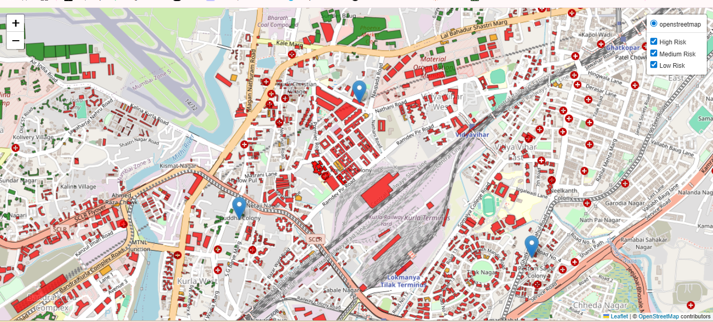
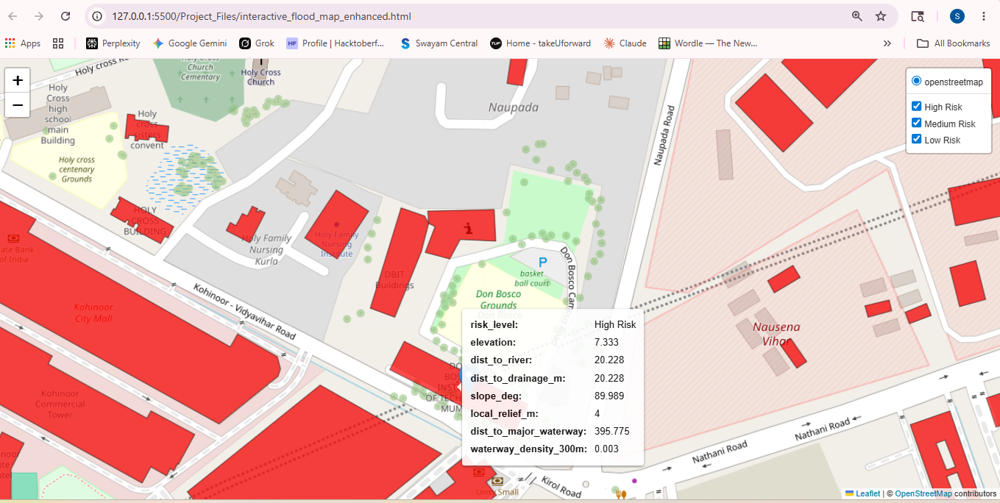

# Flood Vulnerability Mapping Project

## Output(Deployment Link:)

**[Flood Analysis of Kurla region (Ctrl + Click to open in a new tab)](https://kurla-flood-analysis.netlify.app/)**

## Overview

This project builds a **building-level flood vulnerability analysis** for Kurla (Mumbai) using:

- OpenStreetMap (OSM) vector features (buildings, waterways)
- DEM raster elevation data (`kurla.tif`)
- Feature engineering (elevation, distance metrics, terrain, hydrology)
- Unsupervised clustering (K-Means)
- Static and interactive map outputs
- GeoPackage/CSV exports for GIS tools (QGIS)

The main workflow is in the notebook:

- `flood.ipynb`

## Project Files

- `flood.ipynb` - Main notebook containing the full pipeline
- `kurla.tif` - DEM used for elevation and terrain features
- `thane_dem.tif` - Additional DEM available in folder
- `interactive_flood_map.html` - Base interactive map
- `interactive_flood_map_enhanced.html` - Enhanced interactive map with more features
- `flood_vulnerability_map.png` - Static vulnerability map
- `flood_vulnerability_data.gpkg` - Base geospatial export
- `flood_vulnerability_data_enhanced.gpkg` - Enhanced geospatial export
- `flood_vulnerability_feature_report.csv` - Tabular feature export
- `cache/` - OSM/network cache artifacts

## Features Used

### Core features

- `elevation` - Mean building elevation from DEM zonal stats
- `dist_to_river` - Distance from each building to nearest waterway

### Added terrain features

- `slope_deg` - DEM slope at representative building location
- `local_relief_m` - Local elevation range near each building

### Added hydrology features

- `dist_to_major_waterway` - Distance to major waterways
- `waterway_density_300m` - Waterway length density within 300 m neighborhood
- `dist_to_drainage_m` - Distance to nearest drainage-like feature (`drain`, `ditch`, `canal`)

## Modeling

### Current approach

- Model: **K-Means clustering** (`n_clusters=3`)
- Input features (base model): `elevation`, `dist_to_river`
- Cluster labels are mapped to risk classes:
  - High Risk
  - Medium Risk
  - Low Risk

### Evaluation

Because K-Means is unsupervised, use clustering metrics (not supervised accuracy unless ground truth labels exist):

- Silhouette score
- Davies-Bouldin index
- Calinski-Harabasz score

## Output Screenshots:

### Snapshot of output of the interactive Map:



### Snapshot of Don Bsoco Institute of Technology:



## Environment Setup

## 1) Create/activate Python environment

Example with conda:

```powershell
conda create -n geo_env python=3.10 -y
conda activate geo_env
```

## 2) Install dependencies

```powershell
pip install geopandas osmnx rasterio rasterstats pandas scikit-learn matplotlib folium shapely pyproj
```

Optional:

```powershell
pip install geopy
```

## How To Run

Open `flood.ipynb` and run cells in sequence.

Recommended execution order:

1. Install/import cells
2. OSM fetch + DEM load
3. Feature engineering (`elevation`, `dist_to_river`)
4. K-Means clustering + risk mapping
5. Base static and interactive map export
6. Step 8A (terrain features)
7. Step 8B (hydrology features)
8. Step 10 (nearest drainage feature)
9. Step 9 (enhanced output export)

Note:

- Run Step 10 before Step 9 if you want `dist_to_drainage_m` included in enhanced exports.

## Outputs

After successful run, key outputs are:

- `flood_vulnerability_map.png`
- `interactive_flood_map.html`
- `interactive_flood_map_enhanced.html`
- `flood_vulnerability_data.gpkg`
- `flood_vulnerability_data_enhanced.gpkg`
- `flood_vulnerability_feature_report.csv`

## QGIS Usage

1. Open QGIS
2. Drag and drop:
   - `flood_vulnerability_data.gpkg` (base)
   - or `flood_vulnerability_data_enhanced.gpkg` (recommended)
3. Style by `risk_level`
4. Use numeric columns for symbology/analysis:
   - `elevation`
   - `dist_to_river`
   - `dist_to_major_waterway`
   - `waterway_density_300m`
   - `dist_to_drainage_m`

## Common Issues and Fixes

### 1) Missing variables error in Step 8

If you see messages like missing `buildings_with_features`, `dem_array`, or `affine`:

- Re-run earlier pipeline cells (through clustering/feature creation), or
- Ensure required files exist in folder (`kurla.tif`, `flood_vulnerability_data.gpkg`)

### 2) No waterway/drainage returned from OSM

- Try increasing search radius in point-based fetch
- Use fallback logic already included in notebook
- Confirm internet connectivity

### 3) CRS or distance looks wrong

- Ensure metric CRS conversion is done before distance calculations
- Re-run Step 8A and Step 8B in order

### 4) DEM overlap problems

- Use debug cell in notebook to check vector/DEM bounds and CRS
- Confirm `kurla.tif` covers target area

## Next Improvements

- Include rainfall intensity grids and drainage network quality as features
- Move from unsupervised clustering to supervised classification when labeled flood events are available
- Add model comparison and automated report generation

## License / Data Notes

- OSM data is sourced via OSMnx and subject to OSM/OpenStreetMap data terms.
- DEM source/license depends on where `kurla.tif` was obtained.
